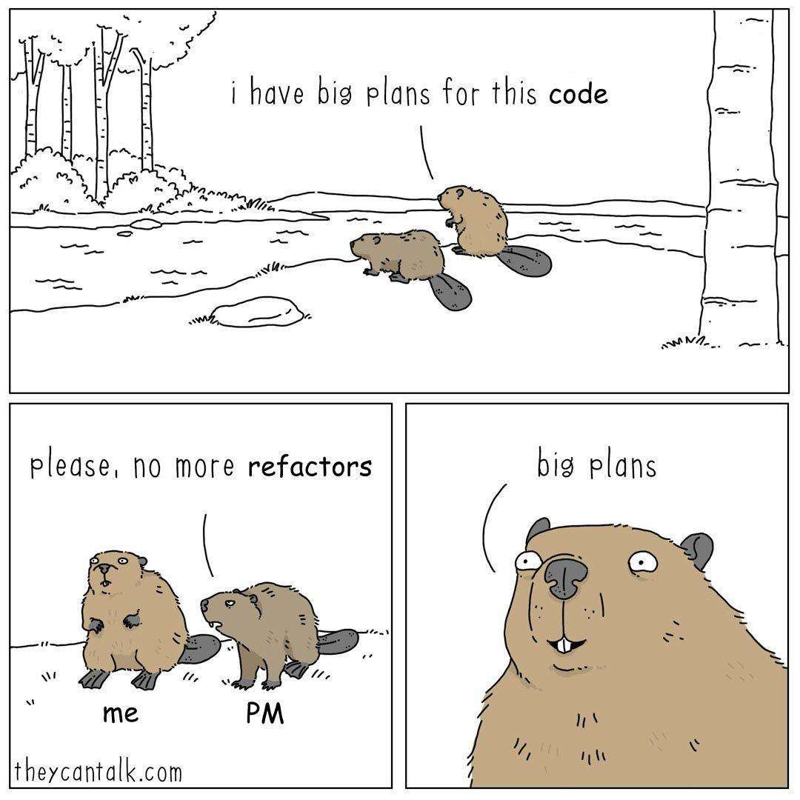

<h2 align="center">
    
     
</h2>

<h4 align="center">
    A TODO list for this repository, updated whenever I have "big plans for this code".
</h4>
 

# All desktops
- Refactor autostart programs so that they are managed by `systemd` instead of an bash script.

# Hyprland
- Fix 1password Quick Access focus issues.
- Add some of the keybinds from previous OS.
- Setup notification daemon ([swaync](https://github.com/ErikReider/SwayNotificationCenter))
- Setup lock screen ([hyprlock](https://github.com/hyprwm/hyprlock))

# Rofi
- Fix `powermenu` styling.
- Setup `rofi-jetbrains` plugin.

# SDDM
- Add custom theme
- Add support for user icons

# Configuration
- De-duplicate flake inputs.
- Implement `overlays` module.
- Better way of creating user.  
  Right now `username` is the only variable, we should allow dynamic descriptions too.  
  Look at: [configuration.nix](configuration.nix#94).
- Create static grub entries for OSes like `Arch Linux` and `Windows`.  
  This will replace `os-prober` and in terms speed up re-build process.

# Apps 
- Setup JetBrains IDEs.